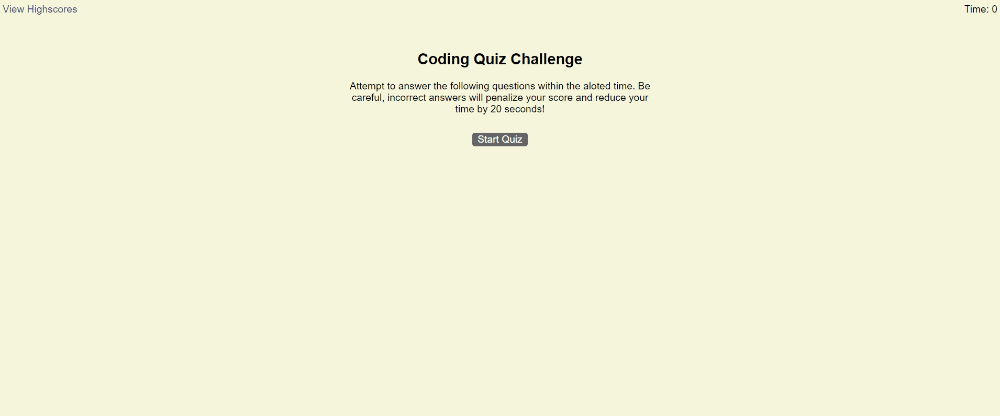

# Code-Quiz

## Description

For this assignment I was tasked with creating a timed Javascript quiz that would test users' knowledge of various javascript fundamentals. This Quiz starts when the user clicks the start button, from there the user is greeted with a ticking timer and a question with 4 multiple choice answers. When a user selects an answer, the code is written to subtract time from the timer if the user is wrong, or notify them of a correct answer and move on to the next question. At the end of the quiz the user will be able to save their score as well as their initials on a leaderboard.
 
This project helped me to better familiarize myself with javascript, specifically using getElementById, localstorage, and JSON.

## Usage

The live site can be viewed at the following link: https://sco5am.github.io/Code-Quiz/

 

## License

MIT License

Copyright (c) [2022] [SamuelOaks]

Permission is hereby granted, free of charge, to any person obtaining a copy of this software and associated documentation files (the "Software"), to deal in the Software without restriction, including without limitation the rights to use, copy, modify, merge, publish, distribute, sublicense, and/or sell copies of the Software, and to permit persons to whom the Software is furnished to do so, subject to the following conditions:

The above copyright notice and this permission notice shall be included in all copies or substantial portions of the Software.

THE SOFTWARE IS PROVIDED "AS IS", WITHOUT WARRANTY OF ANY KIND, EXPRESS OR IMPLIED, INCLUDING BUT NOT LIMITED TO THE WARRANTIES OF MERCHANTABILITY, FITNESS FOR A PARTICULAR PURPOSE AND NONINFRINGEMENT. IN NO EVENT SHALL THE AUTHORS OR COPYRIGHT HOLDERS BE LIABLE FOR ANY CLAIM, DAMAGES OR OTHER LIABILITY, WHETHER IN AN ACTION OF CONTRACT, TORT OR OTHERWISE, ARISING FROM, OUT OF OR IN CONNECTION WITH THE SOFTWARE OR THE USE OR OTHER DEALINGS IN THE SOFTWARE.